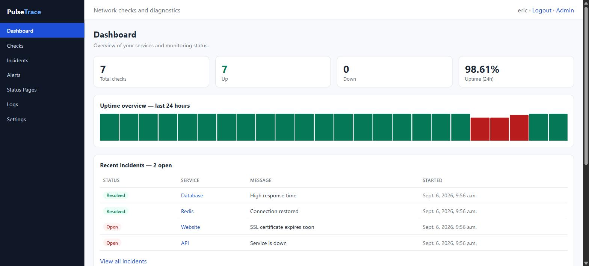
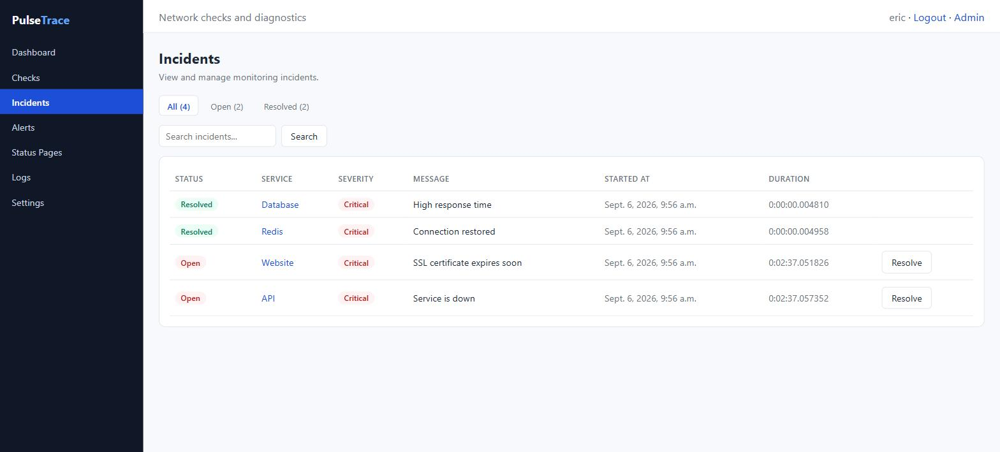
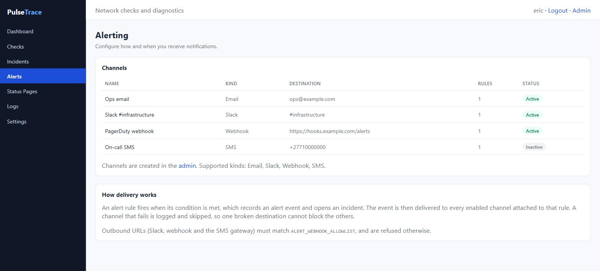
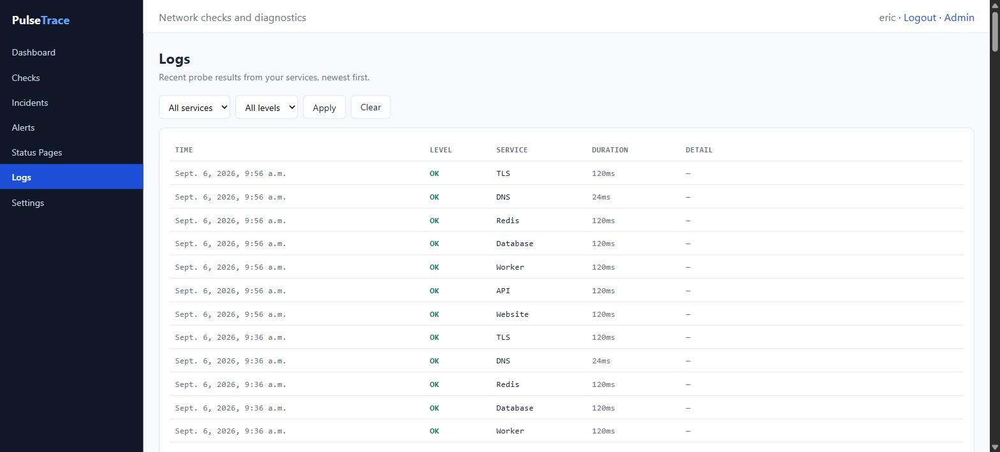
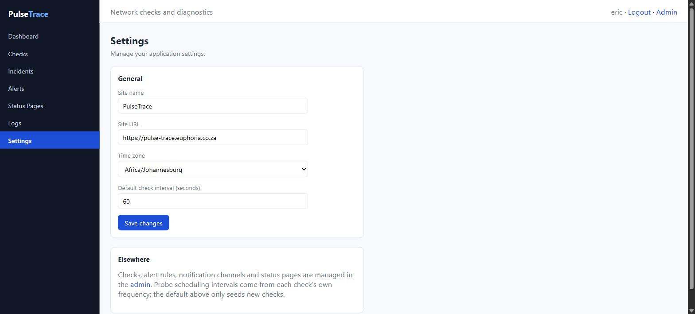
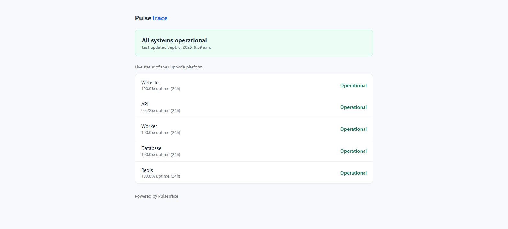

# PulseTrace

PulseTrace is a production-oriented Django app for scheduling safe network diagnostics and storing results.

## What It Does
- Stores check definitions (`dns`, `tcp`, `tls`, `http`)
- Executes checks asynchronously with Celery workers
- Schedules due checks via Celery Beat
- Persists every run result with timings/details/errors
- Evaluates alert rules and stores alert events
- Groups alert events into operator-visible incidents
- Delivers notifications over email, Slack, webhook and SMS
- Publishes shareable status pages
- Exposes an authenticated REST API and a server-rendered operator UI

## Screenshots

The operator UI, captured from a running instance.

**Dashboard** — up/down counts, 24-hour uptime, recent incidents and upcoming checks.



**Incidents** — filter by state, search, and resolve.



**Alerting** — notification channels and how delivery works.



**Logs** — recent probe results, filterable by service and outcome.



**Settings** — site name, URL, time zone and default check interval.



**Public status page** — reachable without signing in.



## Safety Constraints
- No ICMP ping
- No raw packet capture
- No privileged operations
- Probes are restricted to DNS lookups, TCP connect, TLS handshake, and HTTP GET

## Tech Stack
- Python + Django + Django REST Framework
- Celery + Redis
- Postgres (Docker setup), SQLite fallback for local non-Docker use
- dnspython, httpx, tenacity

## Project Structure
```text
pulsetrace/
  manage.py
  pulsetrace/
    settings.py
    urls.py
    celery.py
  apps/
    checks/
      models.py
      serializers.py
      views.py
      urls.py
      tasks.py
      probes/
      services/
      tests/
  templates/
  docker-compose.yml
  .github/workflows/ci.yml
  requirements.txt
```

## Local Run (Docker)
1. Start services:
   ```bash
   docker compose up --build
   ```
2. Create admin user:
   ```bash
   docker compose exec web python manage.py createsuperuser
   ```
3. Open:
   - UI: `http://localhost:8000`
   - Admin: `http://localhost:8000/admin`

## Authentication (API)
Token auth is required for all API endpoints.

Create token:
```bash
curl -X POST http://localhost:8000/api/auth/token \
  -H "Content-Type: application/json" \
  -d '{"username":"admin","password":"your-password"}'
```

Use it:
```bash
export TOKEN="<token>"
```

## API Endpoints
- `POST /api/checks`
- `GET /api/checks`
- `GET /api/checks/{id}`
- `PUT /api/checks/{id}`
- `DELETE /api/checks/{id}`
- `POST /api/checks/{id}/run-now`
- `GET /api/checks/{id}/results?since=2026-01-01T00:00:00Z`
- `GET /api/summary`

### Create a Check (Example)
```bash
curl -X POST http://localhost:8000/api/checks \
  -H "Authorization: Token $TOKEN" \
  -H "Content-Type: application/json" \
  -d '{
    "name": "Example HTTPS",
    "type": "http",
    "target": "https://example.com/health",
    "frequency_seconds": 60,
    "timeout_seconds": 5,
    "retries": 2,
    "enabled": true,
    "alert_rules": [
      {
        "mode": "consecutive_failures",
        "consecutive_failures_count": 3,
        "enabled": true
      }
    ]
  }'
```

### Run Check Immediately
```bash
curl -X POST http://localhost:8000/api/checks/1/run-now \
  -H "Authorization: Token $TOKEN"
```

## Scheduling Model
- Celery Beat runs `enqueue_due_checks` every 60 seconds (configurable)
- The scheduler selects enabled checks that are due (`last_run + frequency_seconds`)
- Each due check is queued to Celery workers with retries + jitter via tenacity

## Alerting
Each check can include one or more alert rules:
- `consecutive_failures`: trigger after N failing runs
- `latency_threshold`: trigger when `total_ms` exceeds threshold for M successful runs

On state transitions, an `AlertEvent` is created (`triggered` / `resolved`).

Optional webhook notifications are supported per rule:
- `webhook_url` must be `http(s)`
- hostname must match `ALERT_WEBHOOK_ALLOWLIST`

### Notification channels

A rule can also be attached to any number of `NotificationChannel` rows,
which are delivered to in addition to the per-rule webhook. Per-kind settings
live in `config_json` and are validated on save:

| Kind | `config_json` | Notes |
|---|---|---|
| `email` | `{"recipients": ["ops@example.com"]}` | Uses Django's configured email backend |
| `slack` | `{"webhook_url": "...", "channel": "#ops"}` | Slack incoming webhook |
| `webhook` | `{"url": "..."}` | Same JSON payload as the per-rule webhook |
| `sms` | `{"numbers": ["+27..."], "gateway_url": "..."}` | Posts to a generic HTTP SMS gateway |

Every outbound URL — Slack, webhook and the SMS gateway — must match
`ALERT_WEBHOOK_ALLOWLIST`, so channels do not widen the SSRF surface. Phone
numbers must be E.164. There is no bundled SMS provider: without a
`gateway_url` the channel logs that it is unconfigured and sends nothing.

Delivery is best-effort per channel. A channel that raises is logged and
skipped, so one broken destination cannot block the others or prevent the
alert event from being recorded.

### Incidents

An `AlertEvent` is one firing of one rule. An `Incident` is the operator-facing
grouping: a check has **at most one open incident** at a time, enforced by a
partial unique constraint, so repeated failures extend the existing incident
rather than creating a new one per failed probe. The original `started_at` is
preserved when an incident is extended, so its duration reflects when the
check actually went down.

## Operator UI

| Route | Page |
|---|---|
| `/` | Dashboard |
| `/checks` | Check list |
| `/checks/<id>` | Check detail and recent results |
| `/incidents` | Incident list, filterable and searchable |
| `/alerts` | Notification channels |
| `/logs` | Recent probe results |
| `/status-pages` | Status page management |
| `/settings` | Instance settings |
| `/status/<slug>` | **Public** status page (no login) |
| `/accounts/login/` | Sign in |

Every route except the public status page and the login page requires
authentication. Checks, alert rules, notification channels and status pages
are created in the Django admin.

## Observability
- Structured JSON logs via `python-json-logger`
- Probe failures are sanitized before persistence/API responses
- Django admin enabled for all models

## Validation and Security Defaults
- Auth required for API endpoints
- Per-user throttle on `run-now` (`10/minute` by default)
- Strict target/port/url validation
- HTTP URLs cannot include credentials
- DNS checks cannot set `port`
- HTTP checks must embed port in URL if needed
- TCP checks require explicit `port`

## Tests and CI
CI file: `.github/workflows/ci.yml`
- Triggers on every `pull_request` and on pushes to `main`
- Installs dependencies
- Runs `ruff` + `black --check`
- Runs `python manage.py test`

Unit tests mock all external network behavior, so default test runs do not require internet access.

## Ambiguities and Safe Defaults Chosen
- Minimum frequency is 30 seconds to avoid excessive load
- TLS default port is `443` when omitted
- Celery beat uses a central “due check scanner” task instead of one beat entry per check
- Webhooks are blocked unless allowlist is explicitly configured
- Error payloads are sanitized and avoid stack traces

## Limitations and Future Work
- HTTP timing currently guarantees `ttfb_ms` and `total_ms` (deeper phase breakdown can be added with a custom transport layer)
- Single-node execution model (no regional agents yet)
- No SLO dashboards yet; only basic summary and recent status views
- V2 idea: multi-probe distributed agents with signed result ingestion and per-region rollups
